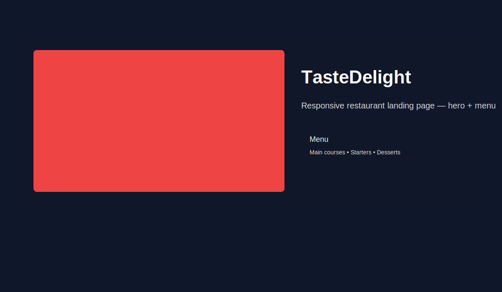
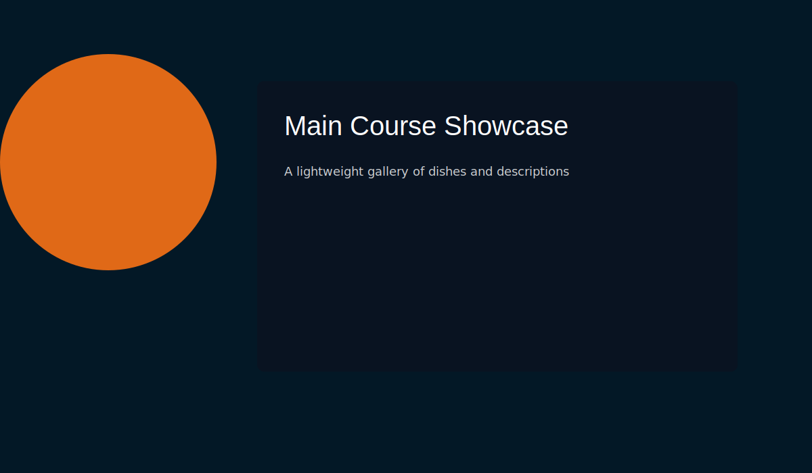
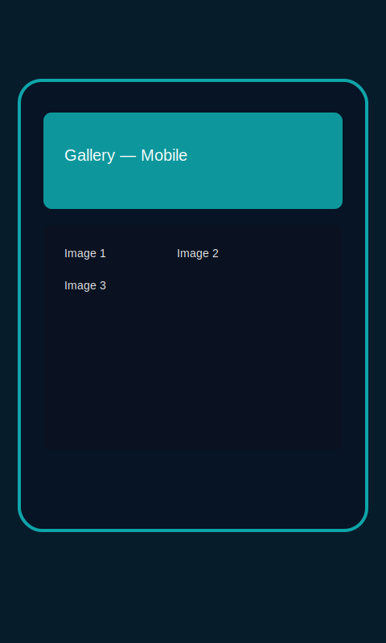

**_ Begin consolidated README replacement (professional build) _**

# 🍽️ TasteDelight — Responsive Restaurant Website

[](https://solotechrics.github.io/responsive-restaurant-website/)
[](https://github.com/solotechrics/responsive-restaurant-website/actions/workflows/ci.yml)
[](https://github.com/solotechrics/responsive-restaurant-website/actions/workflows/pages-deploy.yml)
[](https://github.com/solotechrics/responsive-restaurant-website/issues)
[](https://github.com/solotechrics/responsive-restaurant-website/graphs/contributors)
[](./LICENSE)

A small, modern, responsive landing page template for restaurants built with HTML, Tailwind CSS and lightweight vanilla JavaScript for UI interactions. This repository contains the prebuilt CSS and site assets so you can preview the site immediately without a build step.

Live demo → https://solotechrics.github.io/responsive-restaurant-website/

---

## 📌 Table of contents

- [Highlights](#-highlights)
- [Screenshots](#-screenshots)
- [Tech stack](#-tech-stack)
- [Project structure](#-project-structure-high-level)
- [Quick start / preview locally](#-quick-start--preview-locally)
- [Recompiling Tailwind (optional)](#recompiling-tailwind-optional)
- [Accessibility & browser support](#-accessibility--browser-support)
- [Contributing](#-contributing)
- [License](#-license)
- [Contact / credits](#-contact--credits)

---

## 🚀 Highlights

- Fully responsive landing layout built with Tailwind utilities
- Clean hero / gallery / menu presentation and reservation/contact UI
- Minimal, dependency-free JavaScript for the interactive parts (menu toggle, tabs, a small carousel)
- Works out-of-the-box — precompiled `src/output.css` included so no build is required to preview

---

## 📸 Screenshots

The repository includes sample images in `src/Images`. These screenshots show the shipped visuals — replace them with production-ready images when needed.

Desktop — hero + menu



Desktop — main course showcase



Mobile — gallery / phone preview



Tip: add a `screenshots/` folder and reference its images if you want to keep README assets separate from site images.

---

## 🛠️ Tech stack

- HTML5
- Tailwind CSS (compiled file included at `src/output.css`)
- Vanilla JavaScript (`src/script.js`)
- Small vendor includes via CDN on the page (AOS, Font Awesome)

---

## 📁 Project structure (high level)

- index.html — Main page / single-page landing
- src/input.css — Tailwind source / utilities
- src/output.css — Precompiled CSS (included for quick preview)
- src/script.js — Page interactions (mobile menu, carousel, tabbed sections)
- src/Images — Images used by the site
- svg/ — SVG sprites and decorative icons

---

## ▶️ Quick start / preview locally

No build required to preview the shipped site — simply open `index.html` in any modern browser. For a local server (recommended for accurate previews), run:

```powershell
npx http-server . -p 8080
# then visit http://localhost:8080
```

### Recompiling Tailwind (optional)

If you want to edit and rebuild the design system locally, install dependencies and run the Tailwind CLI from this repo:

```powershell
npm install
npx tailwindcss -i ./src/input.css -o ./src/output.css --watch
```

That will watch `src/input.css` and overwrite `src/output.css` with your changes.

### Generating optimized screenshots and build assets (optional)

The repository contains SVG placeholder screenshots in `screenshots/`. To generate optimized PNGs for the README, OG images, or to prepare assets for deployment, install dependencies and run the helper scripts (the project includes a small Node script that uses sharp):

```powershell
# install dependencies (this will include sharp as a devDependency)
npm ci

# build the CSS and generate optimized screenshots
npm run prepare-deploy

# or run each step individually
npm run build:css
npm run generate:screenshots
```

If `sharp` is not installed the generator script prints a helpful message and exits — installing dependencies will make it work in CI or locally.

---

## ♿ Accessibility & browser support

- Uses semantic HTML and accessible attributes where helpful (aria-\* where applicable).
- Built with progressive enhancement in mind — core content and navigation remain usable when JS is disabled.
- Designed and tested on current stable versions of Chrome, Firefox, Edge and Safari. For legacy browsers provide lightweight fallbacks if required.

---

## 🤝 Contributing

Thanks for your interest — small, focused PRs are welcome. Suggestions/patches for improved accessibility, images, or performance are especially helpful.

Guidelines

- Open issues for feature requests or bugs before submitting large PRs.
- Keep changes scoped, include screenshots for visual changes, and add tests or verification steps when appropriate.

A `LICENSE` file (ISC) is included in this repository. If you'd like an alternate license or additional license headers added to assets, let me know.

---

## 🧾 License

This project is licensed under the ISC license (see `LICENSE` and `package.json`).

---

## ✉️ Contact / credits

- Author: solorics (owner: solotechrics)
- Live demo / deployed with GitHub Pages: https://solotechrics.github.io/responsive-restaurant-website/
- Images and other assets are located in `src/Images` — verify licensing before reuse in production.

**_ End consolidated README replacement _**
